#Logs MapReduce

The project aims at creating a map/reduce program for parallel processing of the randomly generated logs.

There are 4 main tasks of the project:

**Job 1**: Distribution of different type of log message across predefined time interval and
injected string instances of the designated regex pattern for these log message type.

**Job 2**: Distribution of time intervals sorted in the descending order that contained most log messages of the type ERROR
with injected regex pattern string instances.

**Job 3**: Distribution of different type of log message across the entire log file.

**Job 4**: Distribution of number of characters in each log message for each log message type that contain the highest
number of characters in the detected instances of the designated regex pattern.

# Setting up the environment
#### Compiling code and generating jar file

Traverse to the root directory of the project and compile the code and create jar of the application using the below commands:
```sh
$ sbt clean compile assembly
```

After setting up hadoop execute the below mentioned commands:

Start Hadoop services
```sh
$ ./start-all.sh
```
Create a directory in HDFS to store the input file for the program
```sh
$ hdfs dfs -mkdir /input
```

Traverse to the directory in which the input file i.e the log file is stored and perform the following commands
```sh
$ hdfs dfs -put LogFileGenerator.2021-10-18.log /input
```

# Running the Application
### For MapReduce
Traverse to the folder in which the jar file has been generated and perform the following command.
```sh
$ hadoop jar Rishabh_Goel_CS441_HW2-assembly-0.1.jar MapReduce/RunJobs /input /output
```
The output directory is generated by hadoop. To execute the program again delete the output folder as hadoop raises error when the output folder already exists. Alternatively, you can specify a different output file directory. To delete the output directory, execute the following commands.
```sh
$ hdfs dfs -rm -r /output
```

### For generating log file
```sh
$ sbt clean compile run
```

After running this command, press 1 to run GenerateLogData which creates log file
of the format 'LogFileGenerator.<today's date>.log

### For running integrations tests
```sh
$ sbt clean compile test
```


# Files Used

### For Map Reduce jobs
**LogFileGenerator.2021-10-18.log** - 
Log file generated after running the GenerateLogData scala object. This file is used for performing MapReduce as well as for writing testcases.

**MappersJob1** - From the log file generated over 2 hours, it randomly selects the start time and for an interval of 10 minutes (parameter fetched from application.conf) and in those 10 minutes, finds the logs with the regex pattern and creates a mapper.

**ReducersJob1** - The output of MappersJob1 is used as input and the values are reduced to give count of each log message type over the defined time interval.

**MappersJob2** - From the log file, it creates buckets of 15 minutes each and maps the log message types with the regex pattern.

**ReducersJob2** - The output of MappersJob2 is used as input and values are reduced to give count of each log message type in each bucket.

**MappersJob2_Chain** - The output of ReducersJob2 is stored in an Intermediate location which will be used as input to this mapper and the key and value would be replaced as part of the mapper

**ReducersJob2_Chain** - The output of MappersJob2_Chain is used as input and key and values are swapped again after applying descending sort.

**ValueComparator** - This class overrides the WritableComparable class where we implement our version of compare method for sorting the values in descending order.

**MappersJob3** - From the log file, it finds the logs with the regex pattern across the entire duration of log file and creates a mapper.

**ReducersJob3** - The output of MappersJob3 is used as input and the values are reduced to give count of each log message type over the entire duration of log file.

**MappersJob4** - From the log file, it finds the logs with the regex pattern across the entire duration of log file and creates a mapper of the log message length.

**ReducersJob5** - The output of MappersJob4 is used as input and the values are reduced to give maximum length of each log message with the regex pattern over the entire duration of log file.

**RunJobs** - This class defines the settings for all the 4 jobs. It sets the location of Input/Output file, classes(Text/IntWritable) for Map Reduce jobs.

### For Integrations Tests

**MRTest** - Defines 5 integration tests for testing the functionality of Map Reduce Jobs


#Map Reduce Operations

###Hadoop Directory

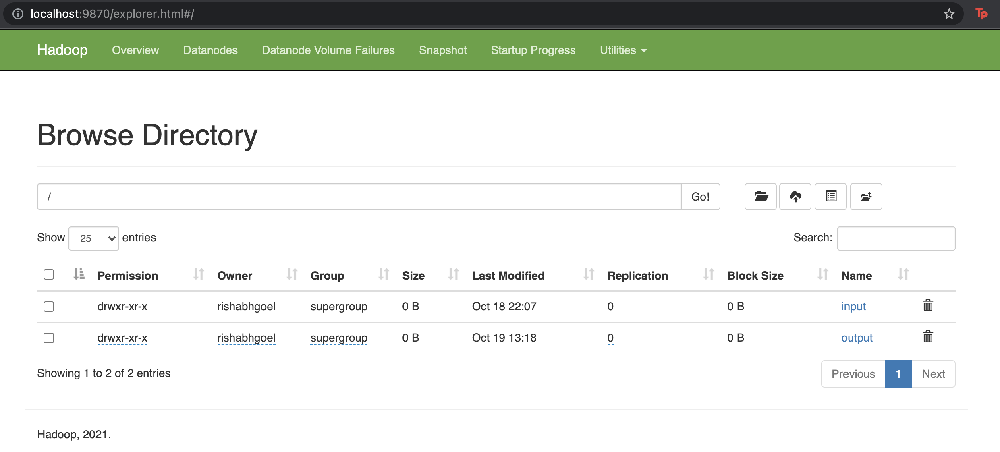

###Input File Directory

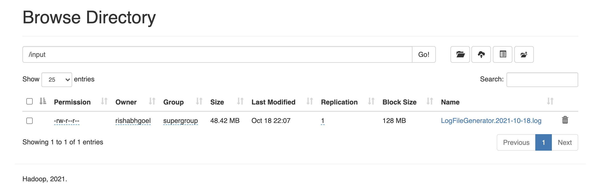


###Output File Directory

Job 1 output stored in **/output/Job1**

Output shown for a period of ten minutes

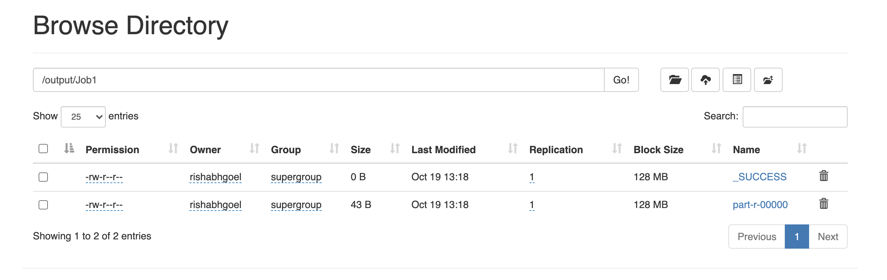

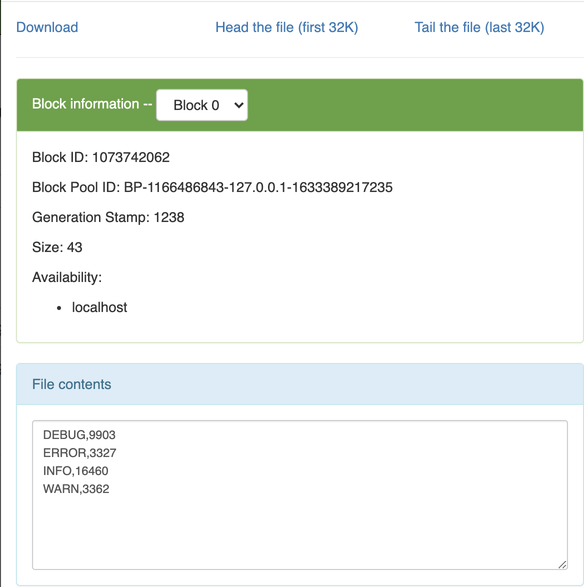

---------
Job 2 intermediate output stored in **/output/Job2_IntermediateResult**

Output shown on the basis of sorted time

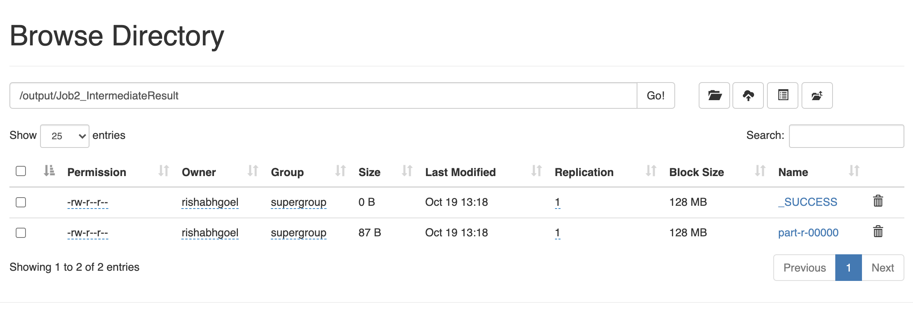

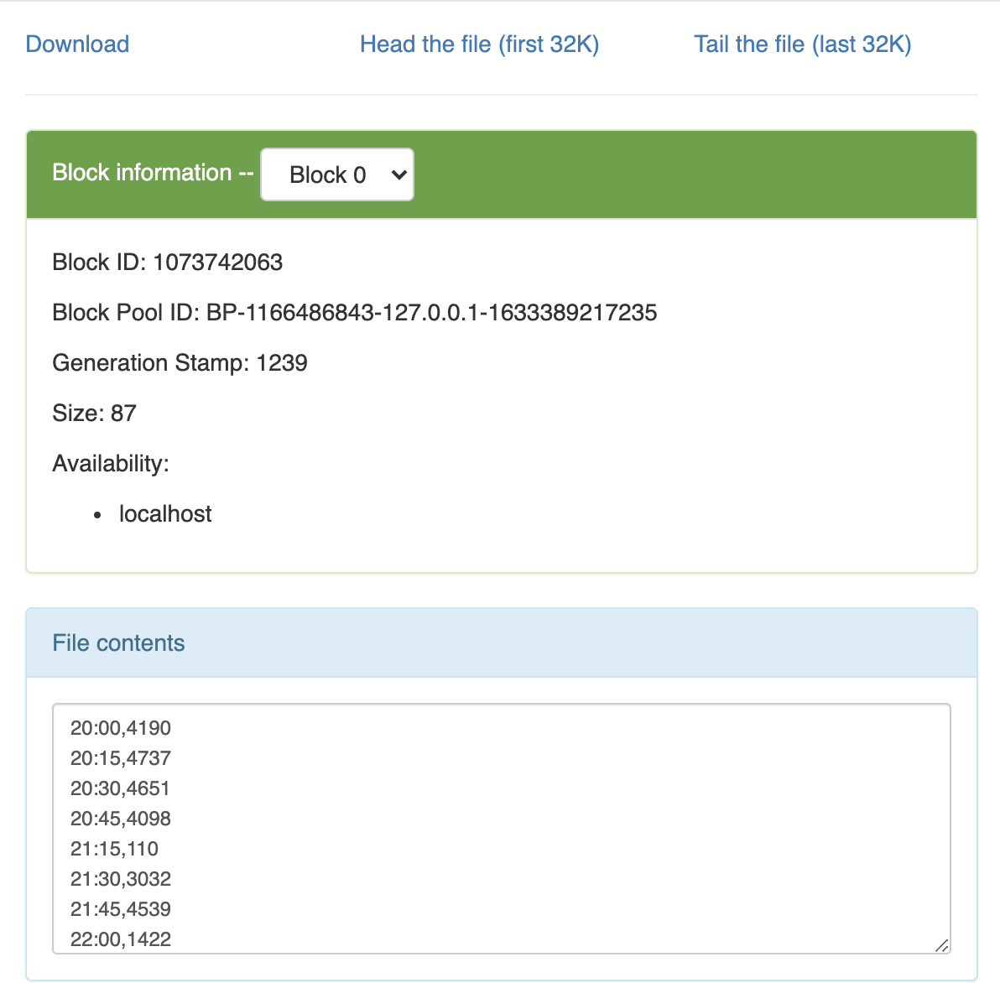

Job 2 output stored in **/output/Job2**

Output shown on the basis of descending count

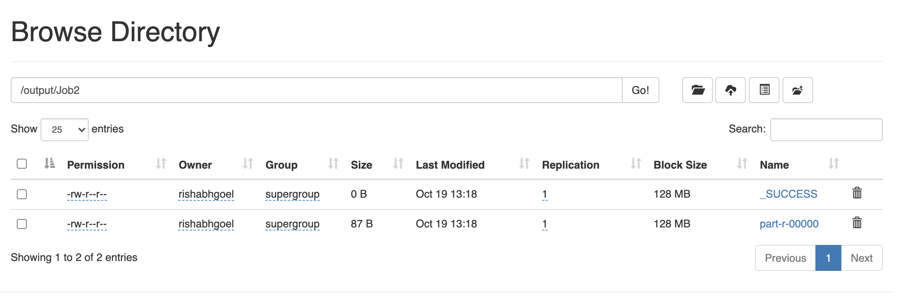

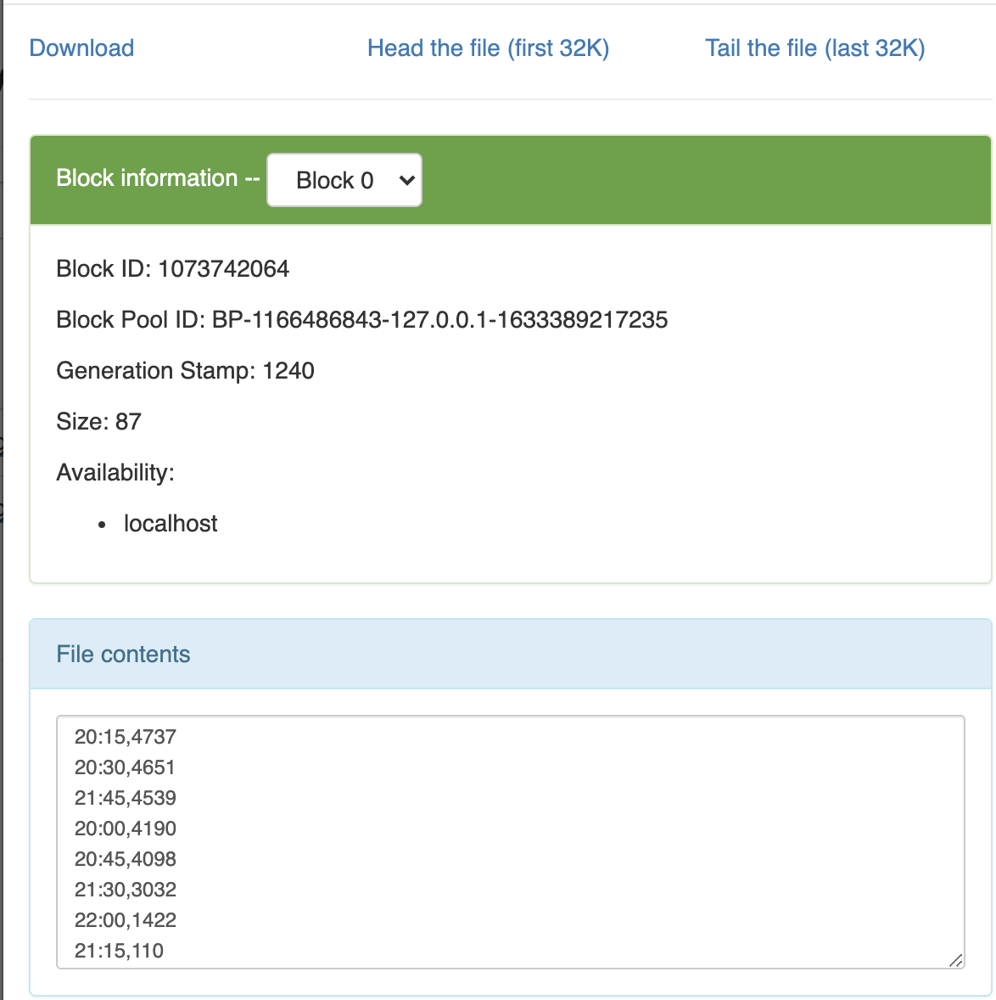

It is interesting to observe that between the time 21:00 to 21:14, there was no log message of type ERROR with the generated regex pattern and that is why it is not included in the output.

To check the correctness of our Map Reduce program for Job 2, we can sum the count in the above screenshot and match it with the count of ERROR from the output of Job 3.

Since the buckets are not predefined, we are not able to show 21:00 with count 0 as an entry of our output.

---------

Job 3 output stored in **/output/Job3**

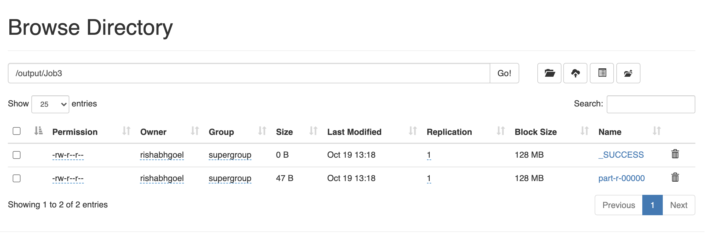

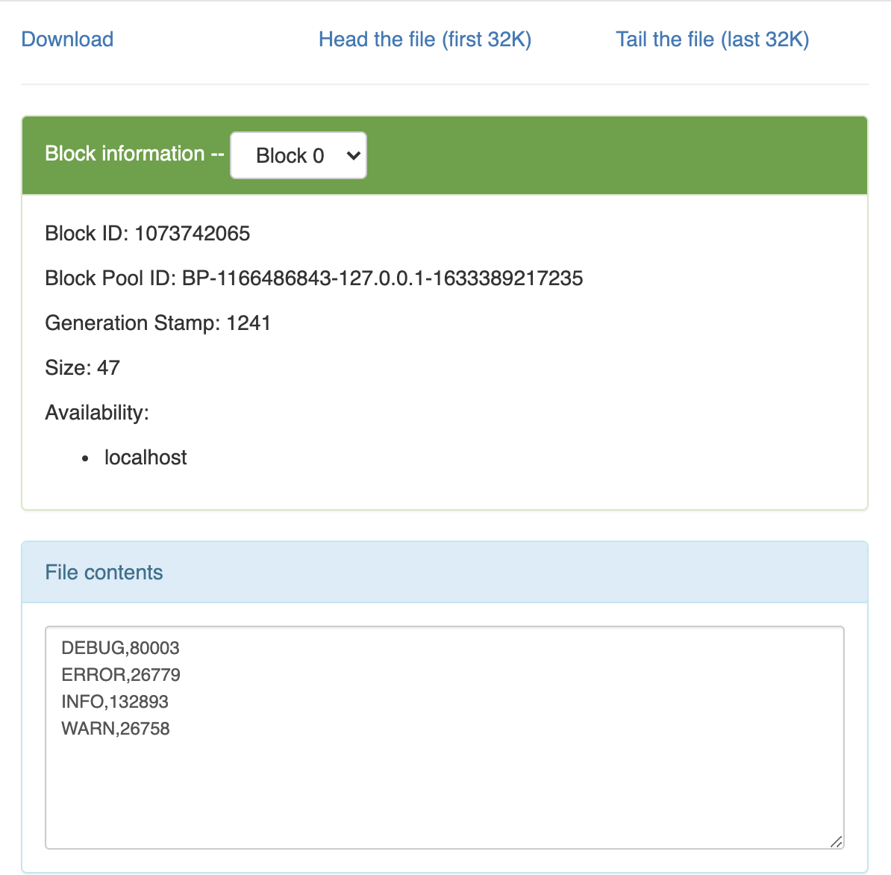

---------

Job 4 output stored in **/output/Job4**

Output shown for maximum length of each log type message


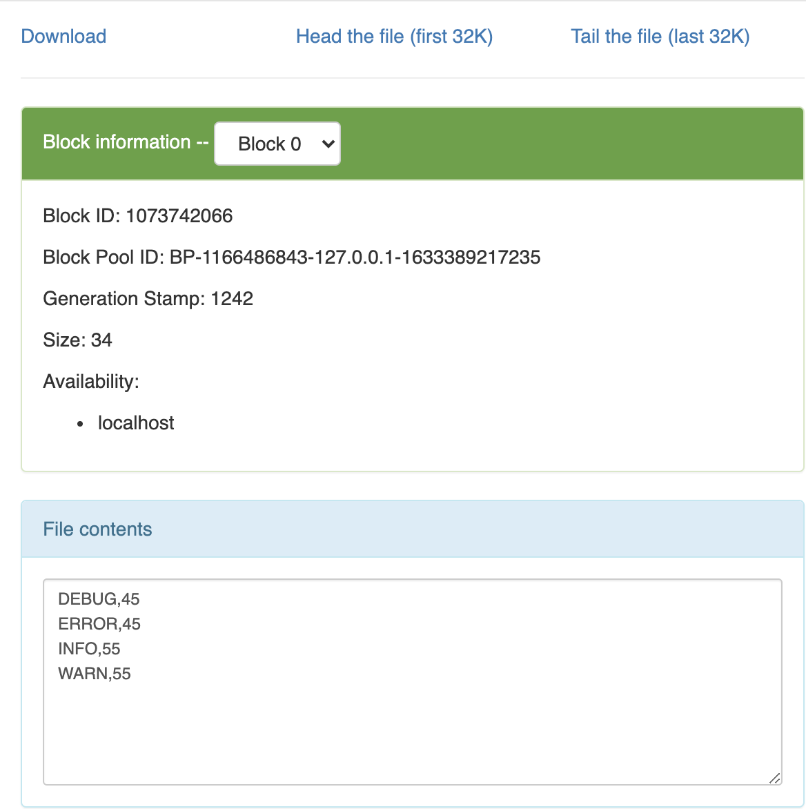


# Implementation on AWS EMR
The program has been implemented on AWS EMR as well. You can refer to the [link](https://youtu.be/SsTNnOcBeng) to get the demo of the entire project and how to deploy it on AWS S3 and AWS EMR.